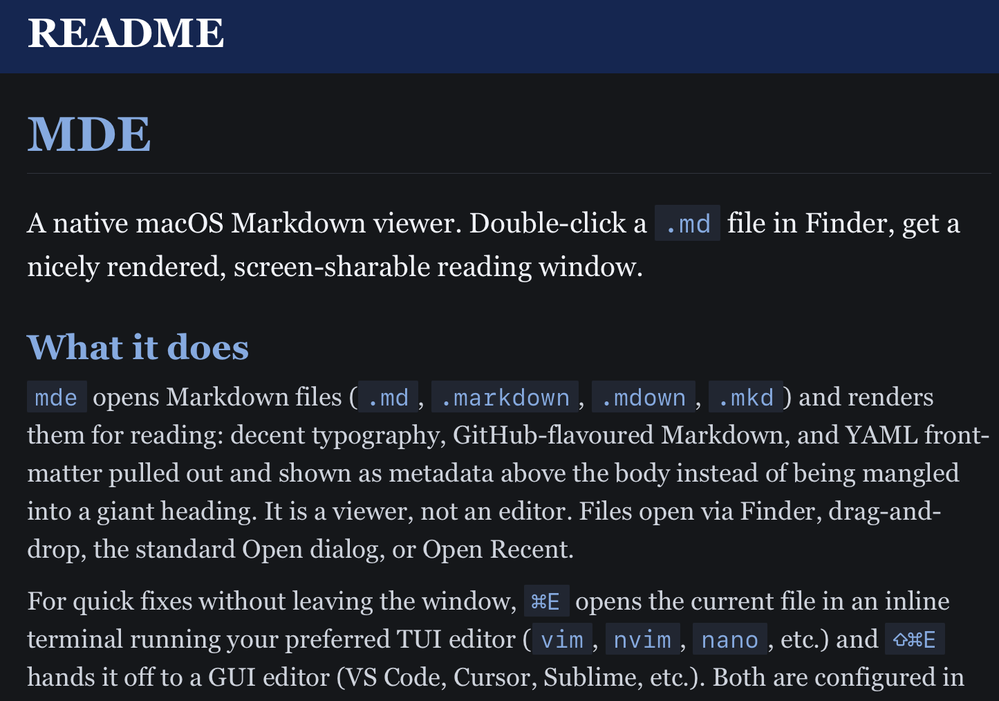

# mde

A native macOS Markdown viewer. Double-click a `.md` file in Finder, get a nicely rendered, screen-sharable reading window.



## What it does

`mde` opens Markdown files (`.md`, `.markdown`, `.mdown`, `.mkd`) and renders them for reading: decent typography, syntax-highlighted code blocks, and YAML front-matter pulled out and shown as metadata above the body instead of being mangled into a giant heading. It is a viewer, not an editor. Files open via Finder, drag-and-drop, the standard Open dialog, or Open Recent.

For quick fixes without leaving the window, `⌘E` opens the current file in an inline terminal running your preferred TUI editor (`vim`, `nvim`, `nano`, etc.) and `⇧⌘E` hands it off to a GUI editor (VS Code, Cursor, Sublime, etc.). Both are configured in **mde → Settings…**, and the preview auto-reloads when the editor saves.

## Quick install (no Xcode required)

Grab the latest `MDE-vX.Y.Z.zip` from the [Releases page](https://github.com/ohnotnow/mde/releases), expand it, and drag `MDE.app` into `/Applications`. Built on GitHub's macOS runners, ad-hoc signed.

### First-launch Gatekeeper

The app isn't Apple-notarised (notarisation needs a paid Apple Developer account), so the first time you double-click it from `/Applications` macOS will refuse with *"MDE.app cannot be opened because Apple cannot check it for malicious software"*. Three workarounds, easiest first:

1. In Finder, right-click `MDE.app` → **Open** → click **Open** again in the warning dialog. macOS only enforces this on first launch; double-clicking works normally afterwards.
2. If that doesn't work, in Terminal: `xattr -dr com.apple.quarantine /Applications/MDE.app`
3. Or skip the dance entirely: download via `curl` or `wget` rather than a browser. The quarantine attribute is set by LaunchServices-aware apps (Safari, Mail, AirDrop) when they save a file from the internet; command-line tools don't apply it. Example:

   ```bash
   curl -L -o mde.zip https://github.com/ohnotnow/mde/releases/latest/download/MDE-v0.1.0.zip
   unzip mde.zip
   mv MDE.app /Applications/
   ```

   (Adjust the version in the URL.)

If you'd rather build from source, read on.

## Prerequisites

- A Mac running macOS 14 (Sonoma) or later
- Xcode 15 or later, free from the Mac App Store

That's it. No Homebrew, no command-line tools, no extra package managers. Xcode brings everything else with it.

## Getting started

If you have never used Xcode before, this section walks through every step. Apologies if some of it is obvious.

### 1. Install Xcode

Open the Mac App Store, search for **Xcode**, install it. It is a hefty download (10+ GB), so put the kettle on. The first time you launch Xcode it will prompt you to install some additional components — say yes to all of those.

### 2. Clone the repository

In Terminal:

```bash
git clone https://github.com/ohnotnow/mde.git
cd mde
```

### 3. Open the project in Xcode

The Xcode project file lives one level down. Either double-click `MDE/MDE.xcodeproj` in Finder, or from Terminal:

```bash
open MDE/MDE.xcodeproj
```

### 4. Wait for Swift Package Manager to resolve dependencies

The first time you open the project, Xcode will fetch the Swift package dependencies (MarkdownUI, Highlightr, and their transitive deps). You will see a small progress indicator at the top of the window saying *"Resolving Package Graph"* or similar. This usually takes 30 seconds to a couple of minutes depending on your connection. Wait for it to finish before doing anything else.

If you ever see "Package resolution failed", try **File → Packages → Reset Package Caches**.

### 5. Run for development

Hit `Cmd-R` (or click the Play button at the top-left). Xcode will compile the project and launch `mde` in a development window. Open a Markdown file from File → Open, drag one onto the window, or use Open Recent.

This is fine for trying it out, but the app only runs while Xcode is alive. To get a real Applications-folder copy, build a release.

## Building a release version for /Applications

When you want to use `mde` like any other Mac app:

### 1. Switch the build scheme to Release

At the top of the Xcode window there is a scheme selector that says something like *"MDE > My Mac"*. Click on **MDE** (the left-hand part) and choose **Edit Scheme…**. In the dialog that appears, select **Run** in the left sidebar, then change **Build Configuration** from *Debug* to **Release**. Click Close.

### 2. Build

Hit `Cmd-B`. Xcode will compile an optimised, debug-symbol-stripped build.

### 3. Find the built app

In Xcode's left sidebar (the Project Navigator), expand the **Products** group at the bottom. You will see `MDE.app`. Right-click it and choose **Show in Finder**.

### 4. Drag to /Applications

Drag `MDE.app` from that Finder window into your Applications folder. You can now launch it like any other app.

### 5. The first-launch Gatekeeper hurdle

Because this app is not Apple-notarised (notarisation requires a paid Apple Developer account), the first time you double-click `MDE.app` from Applications, macOS will refuse to open it and say *"MDE.app cannot be opened because Apple cannot check it for malicious software"*.

The one-time workaround:

1. Open Applications in Finder
2. Right-click on `MDE.app`
3. Choose **Open** from the context menu
4. macOS will show a similar warning but with an **Open** button — click that

After this, you can double-click the app normally forever. macOS only enforces the check on first launch.

## What's in the Settings dialog

Open **mde → Settings…** (or `Cmd-,`):

- **Font Size** — slider plus zoom shortcuts (`Cmd-=`, `Cmd--`, `Cmd-0` from the View menu)
- **Font** — picker showing System Sans, System Serif, Monospaced, and every font installed on your Mac
- **Line Height** — slider from tight (1.1) to airy (2.2)

Settings are persisted in `UserDefaults`, so they survive restarts.

## How the rendering works

Body Markdown is rendered by [MarkdownUI](https://github.com/gonzalezreal/swift-markdown-ui) on top of [cmark-gfm](https://github.com/swiftlang/swift-cmark). Pure SwiftUI, no WebKit. Code blocks are highlighted by [Highlightr](https://github.com/raspu/Highlightr), which is a JavaScriptCore wrapper around highlight.js. I've pinned it to the Nord theme on a `#2E3440` panel background, so the code panel looks the same in light and dark mode.

YAML front-matter at the top of a file (`--- … ---`) gets pulled out and rendered as subdued monospaced metadata above the body, with a dashed separator below. CommonMark has no concept of front-matter, so otherwise it parses as a giant H2 heading, which looks awful.

## Dependencies

Two direct Swift Package Manager dependencies, plus their transitive ones. Xcode resolves them all on first open:

- [gonzalezreal/swift-markdown-ui](https://github.com/gonzalezreal/swift-markdown-ui) — Markdown rendering
- [raspu/Highlightr](https://github.com/raspu/Highlightr) — syntax highlighting
- [swiftlang/swift-cmark](https://github.com/swiftlang/swift-cmark) — the cmark-gfm parser, pulled in transitively by MarkdownUI
- [gonzalezreal/NetworkImage](https://github.com/gonzalezreal/NetworkImage) — image loading, also transitive

Versions are pinned in `MDE/MDE.xcodeproj/project.xcworkspace/xcshareddata/swiftpm/Package.resolved`.

## Contributing

This is a personal project I'm using to learn Swift and AppKit, so I'm not actively soliciting contributions. That said — if you spot something obviously wrong, or want to use the codebase as a starting point for your own viewer, fork away. To get a development environment going, follow the *Getting started* section above. There is no test target yet.

## Licence

MIT. See [LICENSE](LICENSE).
